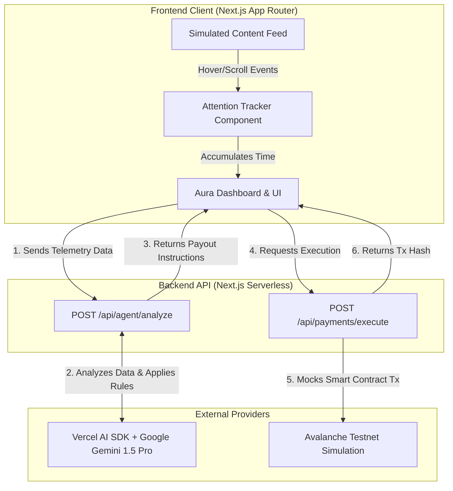

# Aura: System Architecture 🔮

Aura is a Next.js-based autonomous AI payment agent designed for the Team1 India Speedrun. It monitors user attention and streams micro-payments autonomously using generative AI reasoning.

## 1. High-Level Architecture Diagram

---

## 2. Component Breakdown

### A. The Presentation Layer (Frontend)
Built with **React 19**, **Next.js 16**, **Tailwind CSS v4**, and **Framer Motion**.
- **`AuraProvider` Context:** Acts as the local state manager. It temporarily stores the `AttentionLogs` (which content is being read and for how long) and `AgentLogs` (the stdout terminal messages from the AI).
- **`AttentionTracker`:** A silent wrapper component. When a user interacts with a child component (like reading a repository), it fires events to the `AuraProvider` to log the time spent.

### B. The Agentic Brain (Backend Analysis)
Built with **Vercel AI SDK**.
- **Endpoint:** `/api/agent/analyze`
- **Mechanism:** It receives an array of JSON telemetry. It then injects this JSON into a prompt instructing the **Gemini 1.5 Pro** LLM to act as a financial patron.
- **Rule Enforcement:** The AI is instructed to apply multipliers (e.g., 1.5x) to highly technical content. It strictly enforces a minimum USDC threshold.
- **Zod Schema Validation:** The LLM output is forced into a strict JSON schema using `z.object` to ensure the frontend receives deterministic payout arrays.
- **Graceful Degradation:** If the LLM fails or the API key is missing, the backend automatically switches to a deterministic mathematical algorithm (time spent × hourly rate) to ensure the app never breaks during a demo.

### C. The Execution Engine (Backend Payments)
Built for **Avalanche Web3 Integration**.
- **Endpoint:** `/api/payments/execute`
- **Mechanism:** Currently set up as a high-speed simulation. In a production environment, this route would use `viem` or `ethers.js`, load a private key representing the user's "Patron Smart Wallet", and sign a transaction on the Avalanche C-Chain to transfer USDC directly to the creator's wallet.

---

## 3. Data Flow Step-by-Step

1. **Telemetry Collection:** The user hovers over an article for 12 seconds. The `ContentFeed` updates the global `AuraProvider` state with `{ id: "article-1", timeSpentMs: 12000 }`.
2. **Analysis Trigger:** The user clicks "Trigger Analysis". The frontend sends the accumulated logs to the Agent API.
3. **Agentic Reasoning:** The Backend API calls the LLM. The LLM reads that the user spent 12 seconds on an article. It calculates the payout based on a base rate of $0.50/hr.
4. **Instruction Receipt:** The frontend receives the JSON payload: `[{ creator: "0xAlice", amount: 0.0016 }]`.
5. **Execution:** The frontend sends the instruction to the Execution API. The API simulates the network latency of an Avalanche transaction, generates a mock hash, and returns success.
6. **UI Update:** The frontend uses Framer Motion to display a glowing transaction card, and deducts 0.0016 from the user's local Patron Budget.
