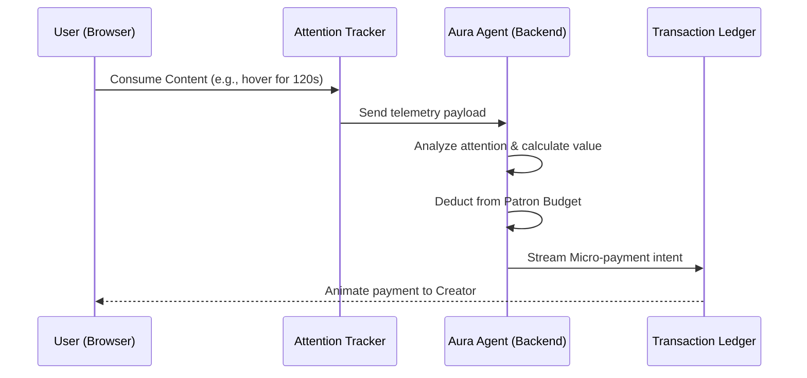

# Aura: Agentic Payments Platform 🔮

Aura is an **Autonomous Micro-Patron Platform** built for the Team1 India Speedrun hackathon (Theme: Agentic Payments). It leverages AI to monitor a user's genuine attention and autonomously streams micro-payments to creators without paywalls or ads.

### 🌐 [Live Demo → aura-app-lac-xi.vercel.app](https://aura-app-lac-xi.vercel.app)


## 🚀 The Vision
The internet is currently broken for long-tail creators. Paywalls cause extreme friction, and ads ruin the user experience. Aura fixes this by acting as a "Financial Copilot". 
Users deposit a monthly Patron Budget. As they browse the web (read articles, watch videos, use GitHub repos), the Aura Agent silently tracks their interaction. It then uses algorithmic reasoning to distribute micro-transactions fairly to the creators who provided the most value.

## ✨ Features & UI/UX Experience
- **True Fullscreen Engine:** A strict flex-based layout ensures the app snaps perfectly to desktop boundaries with smooth internal scrolling.
- **Cyber-Glass Aesthetics:** A rich palette (Deep Purple, Teal, Rose) combined with frosted glassmorphism (`backdrop-filter`) and ambient noise textures.
- **Framer Motion Interactivity:** Every element is animated—from staggered loading cards and physics-based hover states to floating background particles.
- **Dynamic Feedback:** Real-time visual updates, including an animated Wallet Budget pill that flashes amber when a simulated smart contract executes.
- **AI Agent Dashboard:** A custom hacker-style terminal that renders real-time LLM reasoning logs, blurring them in dynamically as the agent processes telemetry.

## 🏗️ Architecture



### Tech Stack
*   **Frontend:** Next.js 14+ (App Router), React, TailwindCSS v4.
*   **UI/UX:** Glassmorphism, Dark Mode, Framer Motion for micro-payment animations.
*   **Backend:** Next.js Serverless API Routes (Simulating Agentic reasoning & blockchain execution).

## 💻 Getting Started

1. Navigate to the app directory:
   ```bash
   cd aura-app
   ```
2. Install dependencies:
   ```bash
   npm install
   ```
3. Run the development server:
   ```bash
   npm run dev
   ```
