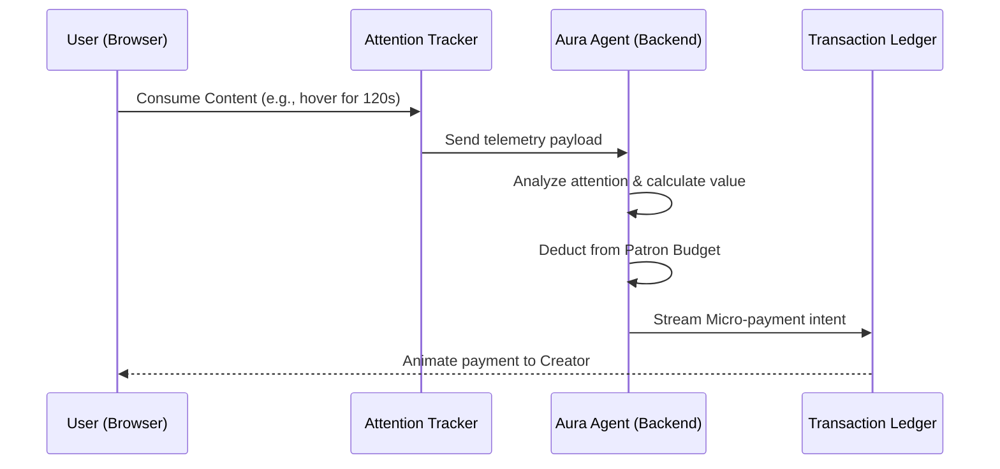

# Aura: Agentic Payments Platform 🔮

Aura is an **Autonomous Micro-Patron Platform** built for the Team1 India Speedrun hackathon (Theme: Agentic Payments). It leverages AI to monitor a user's genuine attention and autonomously streams micro-payments to creators without paywalls or ads.

## 🚀 The Vision
The internet is currently broken for long-tail creators. Paywalls cause extreme friction, and ads ruin the user experience. Aura fixes this by acting as a "Financial Copilot". 
Users deposit a monthly Patron Budget. As they browse the web (read articles, watch videos, use GitHub repos), the Aura Agent silently tracks their interaction. It then uses algorithmic reasoning to distribute micro-transactions fairly to the creators who provided the most value.

## 🏗️ Architecture



### Tech Stack
*   **Frontend:** Next.js 14+ (App Router), React, TailwindCSS v4.
*   **UI/UX:** Glassmorphism, Dark Mode, Framer Motion for micro-payment animations.
*   **Backend:** Next.js Serverless API Routes (Simulating Agentic reasoning & blockchain execution).

## 💻 Getting Started

1. Navigate to the app directory:
   ```bash
   cd aura-app
   ```
2. Install dependencies:
   ```bash
   npm install
   ```
3. Run the development server:
   ```bash
   npm run dev
   ```
